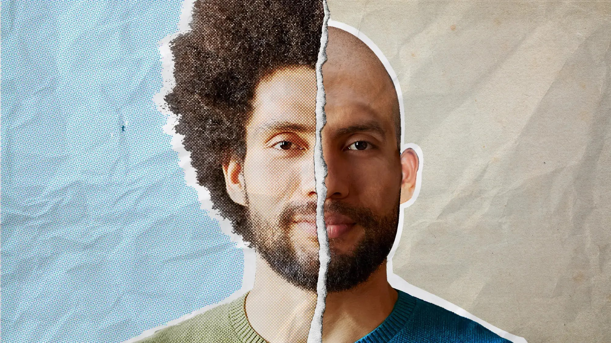

# BaldOrNot
## Project Overview
This project focuses on the binary classification of individuals as either bald or having hair, using image data from the 
[CelebFaces Attributes](https://www.kaggle.com/datasets/jessicali9530/celeba-dataset?resource=download)
The objective is to develop a machine learning model using TensorFlow that accurately predicts whether a person is bald
or not, based on the features extracted from their images.\

## Sample images
\

## CelebFaces

CelebFaces is a dataset available at Kaggle. It contains images of celebrities and is widely used in facial recognition 
research and generative neural networks.
Dataset Contents:

### Images: 
The dataset consists of 202 599 images of celebrity faces.
### Metadata: 
It includes annotations such as 40 facial attributes for each individual (e.g., gender, hair color, glasses, etc.), 
facial landmark points, and identity labels.
### Data Structure:
#### Images Directory: 
Contains all the images, each named with a unique identifier corresponding to the celebrity.
#### Annotations Files:
- **list_attr_celeba.txt**: A text file listing the 40 binary attribute labels for each image.
- **list_bbox_celeba.txt**: Contains bounding box information for each face in the images.
- **list_landmarks_align_celeba.txt**: Provides coordinates for five facial landmarks 
(eyes, nose, and mouth) for each image.
- **list_identity_celeba.txt**: Associates each image with a unique celebrity identity.
### Purpose: 
It can be used for tasks such as face detection, facial attribute analysis, face recognition, 
and facial image generation.

