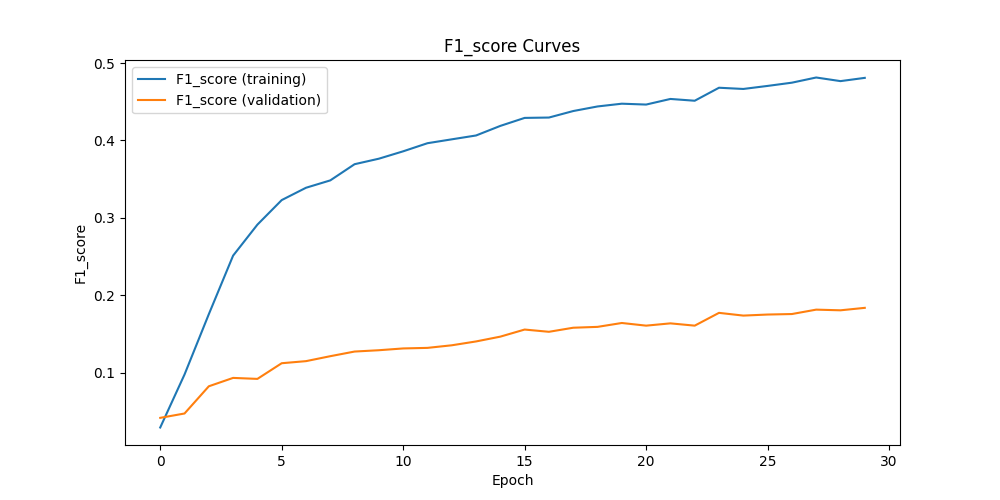

# BaldOrNot
## Project Overview
This project, developed by [raodz](https://github.com/raodz) and [jakub1090cn](https://github.com/jakub1090cn) under the supervision of [skrzypczykt](https://github.com/skrzypczykt), focuses on creating a binary classification model to distinguish between bald and non-bald individuals using the CelebA dataset. Leveraging TensorFlow, the model employs a ConvNeXtTiny backbone for feature extraction, combined with a dense classification head. The dataset presented significant class imbalance, which required targeted preprocessing, augmentation, and the use of F1 score as the primary evaluation metric. The project includes extensive hyperparameter tuning, resulting in a robust approach to handling imbalanced data in computer vision tasks.

## Project Structure
### Diagram
*(To be added)*

### Scripts and Functionalities
1. **prepare_datasets.py**  
   Preprocesses the data by:
   - Removing erroneous files.
   - Integrating separate `.csv` files (one containing labels, another for dataset splits into training, validation, and test sets).
   - Converting file names to numbers to ensure compatibility and simplify usage.
   - Converting labels to binary values (0 for non-bald, 1 for bald), making the dataset suitable for binary classification with sigmoid activation.

   The final output includes three `.csv` files for each data subset: training, validation, and test.

2. **train.py**  
   The main script of the project responsible for model training. It uses hyperparameters from the configuration file, trains the model, and saves the trained model, training history, metrics, and relevant plots.

3. **run_dummy_models_on_val.py**  
   Generates predictions on the validation data using dummy models. These models serve as baselines to evaluate the effectiveness of the actual model:
   - Always predicts 'not bald' (0)
   - Always predicts 'bald' (1)
   - Predicts randomly

## Data
The data used in this project was obtained from the [CelebFaces Attributes CelebA Dataset](https://www.kaggle.com/datasets/jessicali9530/celeba-dataset?resource=download), a widely used dataset in computer vision and deep learning for facial recognition tasks. Originally, the dataset contained 202,599 face images, of which 4,547 were labeled as bald and 198,052 as not bald. After filtering out corrupted files, the numbers were reduced to 3,249 bald and 140,721 non-bald images.

CelebA is ideal for training and testing models aimed at face detection and facial attribute recognition, such as identifying people with specific traits (e.g., brown hair, smiling, wearing glasses). The images in this dataset include a variety of poses, backgrounds, and diverse individuals, making it highly suitable for developing robust computer vision models. The dataset was originally collected by researchers at MMLAB, The Chinese University of Hong Kong, and is supported by comprehensive annotations for each image.

## Sample Images

    
    

## Model
The model uses TensorFlow and consists of two main parts: a ConvNeXtTiny backbone and a classification head. The ConvNeXtTiny backbone, a pre-trained feature extractor, can be frozen during training to retain its learned weights. The classification head includes a global average pooling layer, a dense layer with ReLU activation, an optional dropout layer, and a final sigmoid-activated dense layer, making it suitable for binary classification. This structure allows the model to effectively distinguish between bald and non-bald individuals based on image features.

## Hyperparameter Tuning
**tune_hyperparameters.py**  
Performs hyperparameter tuning for:
   - Learning rate
   - Dense layer units
   - Dropout rate

This script is optional. If not used, hyperparameters can be manually specified in the configuration file. When run, it finds the optimal hyperparameters and saves them to the configuration file automatically.

## Results (In Progress)
This project is still under development, and results are currently available only for the validation set.

    

<em>Figure 1: F1 Score Curves for Training and Validation.</em>

The above plot shows the F1 score progression over epochs for both the training and validation sets. The F1 score was chosen as the primary evaluation metric due to the significant class imbalance between bald and non-bald images. Initially, the model's F1 score improves quickly on the training set, but the validation set shows a slower, more gradual improvement, indicating challenges with generalization.

On the validation set:
- The model achieved a maximum F1 score of around 0.17.
- Dummy models achieved much lower scores: 0.04 (AlwaysBaldModel), 0.00 (AlwaysNotBaldModel) and 0.05 (RandomModel).

## Challenges
### Class Imbalance
The dataset is highly imbalanced, with over 140,000 images of non-bald individuals and slightly over 3,000 images of bald individuals. This imbalance caused the accuracy to increase quickly, creating a false impression of good performance. To address this, several strategies were employed:
   - **F1 Score as Primary Metric**: F1 score was prioritized over accuracy to provide a more balanced view of model performance.
   - **Undersampling**: The majority class (non-bald) was undersampled, with its size controlled by a configuration parameter. The best results were achieved by limiting non-bald samples to roughly three times the number of bald samples, resulting in around 9,000 non-bald samples.
   - **Augmentation**: The minority class (bald) was augmented to help balance the classes, providing more diverse samples and reducing overfitting to specific bald images.
   - **Class Weights**: Class weights were applied to emphasize the minority class during training, helping the model to better learn its features.

### Hyperparameter Tuning
Some hyperparameters could not be tuned with `keras_tuner` and were determined through manual testing:
   - **Batch Size**: Set to 128 after experiments with various values.
   - **Class Ratio**: A 3:1 ratio of non-bald to bald images yielded the best balance.
   - **Augmentation and Class Weights**: Enabled for the minority class, ensuring it had sufficient representation during training.

## Future Work
- **Final Testing**: Complete the training and evaluation on the test set.
- **Further Tuning**: Experiment with additional architectures and more extensive hyperparameter tuning.
- **Optimization**: Improve data preprocessing and model training pipelines for scalability and efficiency.
